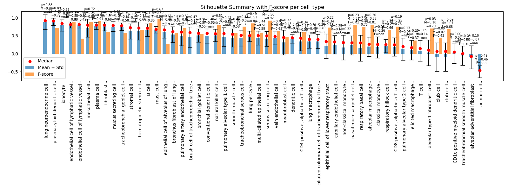
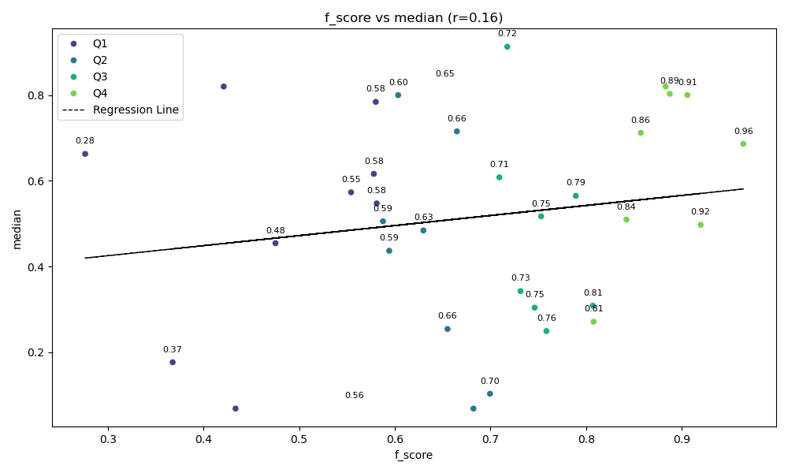

# scsilhouette

[](https://github.com/NIH-NLM/scsilhouette/actions/workflows/docker-publish.yml)

[](https://github.com/NIH-NLM/scsilhouette/actions/workflows/docker-image.yml)

Silhouette scoring and F-score correlation for single-cell RNA-seq cluster validation.

---

## Features

- Compute silhouette scores from `.h5ad` files
- Summarize silhouette stats per cluster
- Visualize F-score vs silhouette correlation
- Overlay NS-Forest F-scores using manual mappings
- Export merged summary stats for downstream analysis

---

## Installation

```bash
git clone https://github.com/NIH-NLM/scsilhouette
cd scsilhouette
conda env create -f environment.yml
conda activate scsilhouette
pip install -e .
```

---

## Command Line Usage

### Compute Silhouette

```bash
scsilhouette compute-silhouette \
  --h5ad-path data/sample.h5ad \
  --label-keys cell_type \
  --embedding-key X_umap \
  --output-dir results/ \
  --save-scores --save-cluster-summary
```

### Visualize Summary

```bash
scsilhouette viz-summary \
  --silhouette-score-path results/cell_type_silhouette_scores.csv \
  --output-dir results/ \
  --label cell_type \
  --score-col silhouette_score_euclidean \
  --fscore-path data/nsforest_scores.csv \
  --mapping-path data/cell_type_cluster_map.csv \
  --show
```



### Visualize F-score Correlation

```bash
scsilhouette viz-fscore \
  --fscore-path data/nsforest_scores.csv \
  --cluster-summary-path results/cell_type_cluster_summary.csv \
  --output-dir results/ \
  --label cell_type \
  --score-col silhouette_score_euclidean \
  --silhouette-stat median \
  --mapping-path data/cell_type_cluster_map.csv \
  --suffix smoke \
  --show --export-csv
```



---

## Quadrant Interpretation

| Quadrant | Meaning                                                                 |
|----------|-------------------------------------------------------------------------|
| Q1       | High Silhouette, High F-score → Good clustering & markers            |
| Q2       | High Silhouette, Low F-score → Well-separated clusters, weak markers |
| Q3       | Low Silhouette, Low F-score → Poor clustering and weak markers       |
| Q4       | Low Silhouette, High F-score → Good markers, weak clustering         |

---

## Nextflow Workflow

**Overview**

This repository includes a modular Nextflow pipeline that performs silhouette scoring and quality control visualizations for .h5ad files. Each computational step is implemented as an individual Nextflow module in the modules/ directory. The master workflow is defined in main.nf.

The pipeline supports:

* Single dataset input using --h5ad, --label_key, --embedding_key

* Batch dataset input using --datasets_csv or --datasets (inline list)

* Output isolation per dataset in results/{dataset_name}/

* Generation of summary HTML and PDF reports

## Usage

Install Nextflow and ensure Docker is available.

1. Single .h5ad Dataset

```bash
nextflow run main.nf -profile docker \
  --h5ad data/sample.h5ad \
  --label_key cell_type \
  --embedding_key X_umap
```

2. Batch Mode via CSV

Prepare a CSV file like:

```csv
h5ad,label_key,embedding_key
s3://bucket/sample1.h5ad,cell_type,X_umap
s3://bucket/sample2.h5ad,cell_type,X_tsne
```

Then run:

```bash
nextflow run main.nf -profile docker \
  --datasets_csv path/to/datasets.csv
```

3. Batch Mode via Inline List

```bash
nextflow run main.nf -profile docker \
  --datasets '[["data/sample1.h5ad", "cell_type", "X_umap"], ["data/sample2.h5ad", "final_labels", "X_tsne"]]'
```

## Outputs

Each dataset produces the following under results/{dataset_name}/:

* scores/: Silhouette scores and cluster summaries

* summary/, heatmap/, dotplot/, distribution/, dataset_summary/: Visualizations

* report/: Combined *_report.html and *_report.pdf

## Modular Design

Each pipeline process is defined in a separate module in modules/:

```bash
modules/
├── compute_silhouette.nf
├── viz_summary.nf
├── viz_dotplot.nf
├── viz_heatmap.nf
├── viz_distribution.nf
├── viz_dataset_summary.nf
└── merge_report.nf
```

These are imported in main.nf using DSL2 include {} syntax for clarity and reuse.

## Profiles
docker: Use the container published at ghcr.io/nih-nlm/scsilhouette

nfcopilot: Compatible with Lifebit Copilot on AWS


## Documentation

Full API and CLI documentation is auto-generated with [Sphinx](https://www.sphinx-doc.org/) using `autodoc`, `autosummary`, and `literalinclude` for CLI help injection.

Deployed using [GitHub Pages](https://pages.github.com/) at:

https://nih-nlm.github.io/scsilhouette/

All rendered figures used in this README are stored under `docs/source/_static/` and referenced within reStructuredText files for Sphinx processing.

---

## Testing (Coming Soon)

```bash
pytest tests/
```

---

## License

MIT License © National Library of Medicine, NIH

